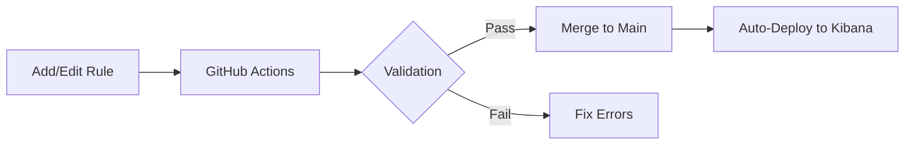

# Elastic Detection-as-Code (DaC) Pipeline

[](https://github.com/GBinion2020/Elastic-Detection-as-Code/actions/workflows/validate.yml)
[](https://github.com/GBinion2020/Elastic-Detection-as-Code/actions/workflows/deploy.yml)

## Executive Summary

This project demonstrates a professional **Detection-as-Code (DaC)** workflow using the Elastic Stack. It bridges the gap between security research and operational deployment by treating detection rules like software. By leveraging CI/CD pipelines, automated schema validation, and version control, this repository ensures that detection logic is high-quality, tested, and deployable with high confidence.

---

## Core Pillars

### 1. Detection Engineering
All rules are stored in human-readable YAML/JSON formats, mapped to the **MITRE ATT&CK®** framework.
- **Rule Support**: Supports EQL (Event Query Language) and KQL (Kibana Query Language).
- **Template-Driven**: Uses a standardized [Template_Detection.yml](file:///d:/Elastic-Detection-as-Code/Template_Detection.yml) to ensure consistency across all rule developments.

### 2. Automated Validation
Every rule is automatically validated against a strict [JSON Schema](file:///d:/Elastic-Detection-as-Code/Schemas/Schema1.json) before it can be merged. This prevents:
- Syntactic errors in rule files.
- Missing required fields (e.g., `rule_id`, `severity`).
- Invalid risk scores or improper ATT&CK mappings.

### 3. CI/CD Lifecycle
The pipeline automates the entire lifecycle of a detection rule:


---

## Repository Structure

- `Detections/`: Categorized detection rules (Windows, Linux, Cloud, etc.).
- `Schemas/`: JSON schemas used to enforce rule standards.
- `scripts/`:
  - `validate_rules.py`: Local and CI script for schema enforcement.
  - `deploy_rules.py`: Automation for pushing rules to the Kibana API.
- `.github/workflows/`: GitHub Actions definition for the CI/CD pipeline.
- `tests/`: Unit tests for the automation logic.

---

## Getting Started

### Prerequisites
- Python 3.9
- Access to an Elastic Stack (Kibana URL + API Key)
- GitHub Runner (My Elastic Stack is not public facing)

### Local Setup
1. **Clone the repo**:
   ```bash
   git clone https://github.com/GBinion2020/Elastic-Detection-as-Code.git
   cd Elastic-Detection-as-Code
   ```
2. **Install dependencies**:
   ```bash
   pip install -r requirements.txt

   ```
3. **Configure Environment Variables**:
   ```bash
   # Windows (PowerShell)
   $env:KIBANA_URL="https://your-kibana-url"
   $env:KIBANA_API_KEY="your-api-key"
   Also be sure to add to your Github secrets the KIBANA_URL and KIBANA_API_KEY
   ```

### Developing Rules
1. Create a new `.yml` file in the `Detections/` directory (use `Template_Detection.yml` as a guide).
2. Run validation locally:
   ```bash
   python scripts/validate_rules.py
   ```
3. Push your changes and open a Pull Request to trigger the CI validation.

---

## Future Roadmap
- [ ] Atomic-Red Team / Stratus-Red Team,  simulation Detections
- [ ] Integration with Sigma for cross-platform rule conversion.
- [ ] Automated Detection as Code AI-Agent 

